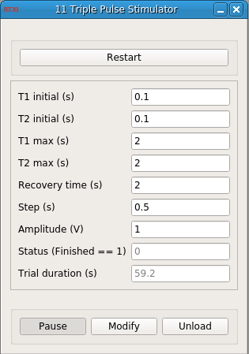

### Triple Pulse Stimulator

Developed by Rodrigo Amaducci (rodrigo.amaducci@uam.es)
Grupo de Neurocomputación Biológica (GNB), Universidad Autónoma de Madrid, 2018

**Requirements:** None  
**Limitations:** None  

<!--start-->

<b>Triple Pulse Stimulator:</b> Generates groups of three pulses with separation T1 between pulses 1 and 2, and T2 between pulses 2 and 3. T1 and T2 values will be mapped from their initial values to their maximum ones, leaving an specific recovery time between each group.

<!--end-->

#### Input

#### Output
1. output(0) - Pulse (V) : Pulse generated
2. output(1) - Event : Identificator of the pulse generated (1, 2 or 3)

#### Parameters
1. T1 initial (s) - Initial time for the T1 interval
2. T2 initial (s) - Initial time for the T2 interval
3. T1 max (s) - Maximum time for the T1 interval
4. T2 max (s) - Maximum time for the T2 interval
5. Recovery time (s) - Recovery time between groups of pulses
6. Step (s) - Time step for the intervals
7. Amplitude (V) - Generated pulses amplitude

#### States
1. Status (Finished == 1) - When the trial ends, status is 1
